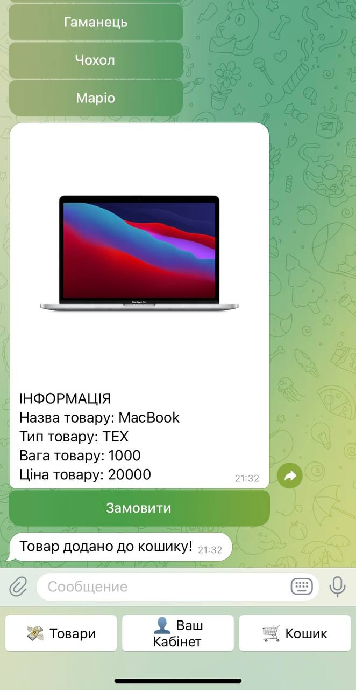
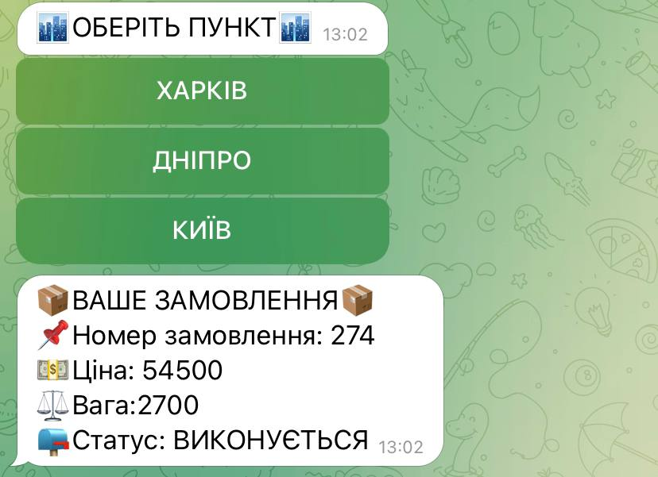
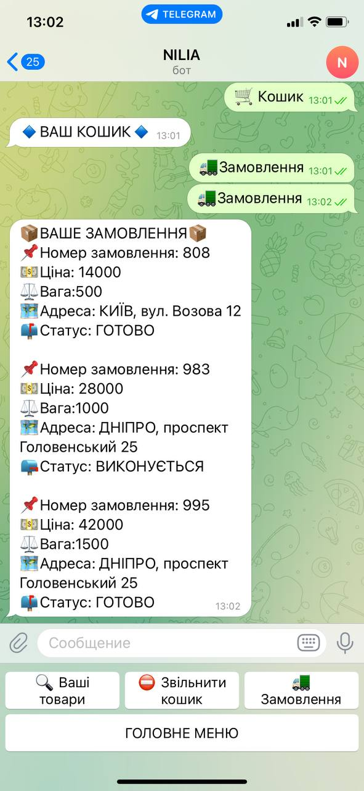

# Telegram Shop Bot in Python

This project is a Telegram shop bot developed in Python using the [pyTelegramBotAPI](https://github.com/eternnoir/pyTelegramBotAPI). The bot allows users to register, browse products, place orders, update their information, and view their orders and their statuses.

## Table of Contents

- [Description](#description)
- [Requirements](#requirements)
- [Screenshots](#screenshots)

## Description

This bot provides users with the following features:

- Registration of a new user
- Browsing available products
- Adding products to the cart and placing orders
- Updating personal information
- Viewing orders and their statuses (pending, completed, canceled, etc.)

## Requirements

Before getting started, ensure you have the following components installed:

- Python 3.6 or newer
- The `pyTelegramBotAPI` library
- The `sqlite3` library or another database handling library

## Screenshots

### Homepage
 <!-- Add screenshot of the homepage -->

### Registration Step 1
 <!-- Add screenshot of registration step 1 -->

### Registration Step 2
 <!-- Add screenshot of registration step 2 -->

### Registration Step 3
 <!-- Add screenshot of registration step 3 -->

### Products Page
 <!-- Add screenshot of the products page -->

### Products Page
 <!-- Add screenshot of the products page -->

### Products Page
 <!-- Add screenshot of the products page -->

### Products Page
 <!-- Add screenshot of the products page -->

### Basket Page
 <!-- Add screenshot of the basket page -->

### Basket Page
 <!-- Add screenshot of the basket page -->

### Basket Page
 <!-- Add screenshot of the basket page -->
